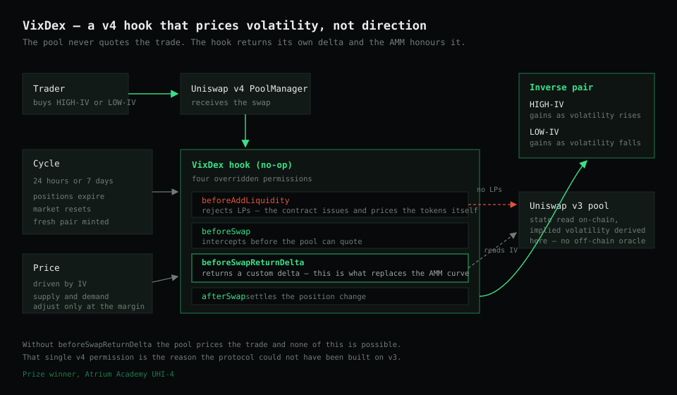

<div align="center">

# VixDex

**Trade volatility itself, on-chain, with no liquidity providers.**

[](https://docs.uniswap.org/contracts/v4/overview)
[](https://atrium.academy)
[](https://soliditylang.org)
[](https://book.getfoundry.sh)
[](https://huff.sh)



</div>

---

## What this is

A Uniswap v4 hook that turns implied volatility into something you can hold a position in.

Traditional finance has VIX options for this. On-chain you could bet on price direction,
but not cleanly on how violently price would move. VixDex prices two opposing tokens
against an asset's implied volatility, so a trader can take a side on turbulence itself
rather than on where the market ends up.

**Winner of the Uniswap hook prize at Atrium Academy UHI-4.**

## How it works

Two tokens per market, inversely correlated by construction:

| Token | Gains when |
|---|---|
| `HIGH-IV` | Implied volatility rises |
| `LOW-IV` | Implied volatility falls |

Price is driven primarily by implied volatility, with supply and demand applying only a
minor adjustment. Positions run on a fixed cycle of 24 hours or 7 days. At the end of each
cycle positions expire, the market resets, and a fresh pair of IV tokens is minted.

**No liquidity providers.** The contract manages issuance and pricing itself, rather than
depending on someone showing up to quote a two-sided market in a product most people have
never traded. That removes the bootstrap problem that kills most exotic on-chain
derivatives before they get going.

Implied volatility is derived from Uniswap v3 pool data, with the calculation performed
on-chain rather than fed in by an off-chain oracle.

## The hook

Deployed as a **no-op hook** against the Uniswap v4 pool manager, overriding four
permissions:

```
beforeAddLiquidity      liquidity provision is handled by the contract, not by LPs
beforeSwap              intercepts the swap before the pool prices it
afterSwap               settles the position change
beforeSwapReturnDelta   returns a custom delta, which is what allows the
                        IV-driven pricing curve to replace the pool's own
```

`beforeSwapReturnDelta` is the mechanism that makes the whole thing possible. It is what
lets a v4 hook substitute its own pricing model for the AMM's, and it is why this design
could not have been built on v3.

## Stack

| | |
|---|---|
| Protocol | Uniswap v4 hooks, reading Uniswap v3 pool state |
| Contracts | Solidity, with Huff for hand-written EVM where it matters |
| Toolchain | Foundry (`forge`, `anvil`) |
| Libraries | OpenZeppelin, v4-core, v4-periphery, v3-core, v3-periphery, permit2, universal-router |
| Testing | Anvil fork of Sepolia and mainnet |

## Setup

```bash
git clone https://github.com/vixdex/vixdex.git
cd vixdex/hooks
```

Uniswap libraries:

```bash
forge install https://github.com/Uniswap/v4-core
forge install https://github.com/Uniswap/v4-periphery
forge install uniswap/v3-periphery
forge install uniswap/v3-core
forge install uniswap/permit2
forge install uniswap/universal-router
forge install uniswap/v2-periphery
forge install uniswap/v2-core
```

OpenZeppelin and the Huff integration (install the Huff compiler first):

```bash
forge install OpenZeppelin/openzeppelin-contracts
forge install huff-language/foundry-huff
```

Then fork a network with `anvil` and run the test suite against it.

## Related repositories

| | |
|---|---|
| [`vixdex`](https://github.com/vixdex/vixdex) | The hook and contracts |
| [`vixdex_Interface`](https://github.com/vixdex/vixdex_Interface) | Trading interface |
| [`vixdex-node`](https://github.com/vixdex/vixdex-node) | Node services |
| [`vpt-price-tracker`](https://github.com/vixdex/vpt-price-tracker) | Price tracking |

## Status

A working protocol and a prize-winning hook, not an audited production system. The pricing
curve is explicitly designed to evolve. Do not put real money behind it without an audit.
